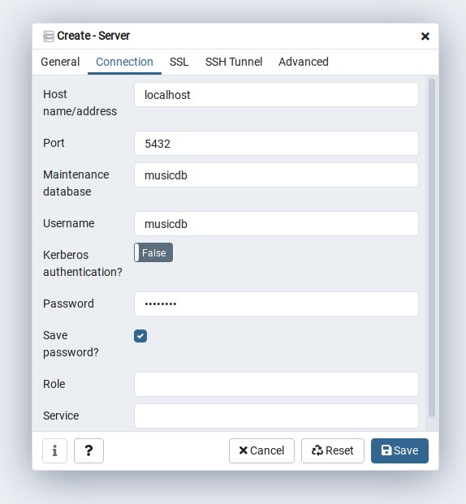

# spring-jdbc
Spring JDBC example from the *Pro Spring 5* book ported to Kotlin and Postgres.

## Install PostgreSQL

On Debian Linux, PostgreSQL can be installed with the following command:

```bash
# apt-get install postgresql postgresql-doc
```

Both the default database user and default database are called postgres

## Create a user and database for the system user

By default, Postgres uses a concept called “roles” to handle authentication and authorization.
After installation Postgres is set up to use ident authentication, meaning that it associates Postgres roles with a matching Unix/Linux system account.

Use su to switch to the postgres acount and create a user with the same name as the system user:

```
$ su -
# su -s /bin/bash postgres
postgres@debian:/root$ createuser -s username
```
The -s option grants superuser privileges.

Next we need to create a database for the user:

```bash
postgres@debian:/root$ createdb -O username username
```

Now try to start psql as a normal user:

```bash
$ psql
username=# \q
```

## Create musicdb user and database

After setting up a user for the local system user, we no longer need to switch to the postgres account to run postgres commands.
Add an instagram postgres user:

```bash
$ createuser -P musicdb
```

This creates an musicdb user that is not allowed to create new databases or roles and is not superuser. The -P flag will display a password prompt to set a password for the user.

To create the musicdb database, run the follwing command:

```bash
$ createdb -O musicdb musicdb 
```
## Install PGAdmin

[pgAdmin](https://www.pgadmin.org/) is a popular feature-rich open source database administration tool for PostgreSQL. 
Follow the instructions on the web site to install it.

On Debian Linux, pgAdmin is installed in `/usr/pgadnmin4`. Start pgAdmin and create a new Server by right-clicking on Servers and selecting Create -> Server...
The name should be localhost, switch to the connection tab and enter the required information:



## Create tables and stored functions

Right-click on the musicdb database in pgAdmin and select *Query Tool* from the context menu. Copy and paste the contents of `src/main/resources/sql/schema.sql` into the Query Tool window and run it. Also copy and paste the contents of `src/main/resources/sql/stored-function.sql` into the Query Tool window and run it.

## Import data

Right-click on the musicdb database in pgAdmin and select *Query Tool* from the context menu. Copy and paste the contents of `src/main/resources/sql/test-data.sql` into the Query Tool window and run it.

## Runnig tests

Before running tests, set the correct password in `src/main/resources/db/jdbc2.properties`. `DbConfigTest` tests the database connection, `AnnotationJdbcTest` tests typical database CRUD operations.
